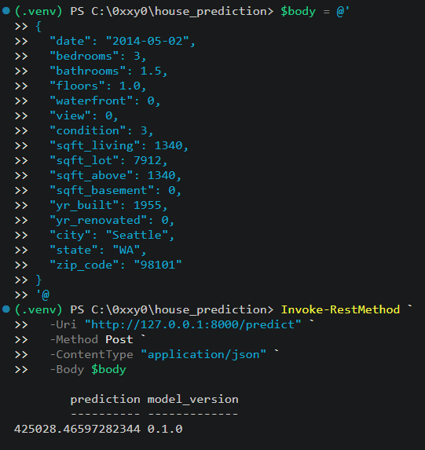

# 🏛️ Intelligent Price Prediction Platform

### Production-Grade ML Engineering · End-to-End System Design · Deployment-Ready

A fully architected, tested, and containerized machine learning platform that demonstrates the complete lifecycle of a production ML system — from immutable raw data contracts to a live, typed, health-checked prediction API.

> **This is not a notebook. This is a system.**

---

## 🎯 Executive Summary

This repository implements a production-disciplined **house price prediction platform** designed around real-world ML engineering principles:

- Data contracts
- Deterministic pipelines
- Training-serving parity
- Chronological validation
- Versioned artifacts
- Operational readiness

Every layer — **ingestion, validation, cleaning, feature engineering, training, persistence, and serving** — is modularized, typed, linted, and covered by an extensive automated test suite.

The result is a system that behaves the way ML services are actually **built, reviewed, shipped, and maintained in industry**.

---

## 🏗️ System Architecture

```
┌───────────────────────────────────────────────────────────────────────┐
│                         RAW DATA (IMMUTABLE)                          │
│                    data/raw/KC_housing_data.csv                       │
└───────────────────────────────┬───────────────────────────────────────┘
                                │
                    ┌───────────▼───────────┐
                    │   SCHEMA VALIDATION   │  ⟶ profile.json / profile.md
                    │   + PROFILING LAYER   │
                    └───────────┬───────────┘
                                │
                    ┌───────────▼───────────┐
                    │  DETERMINISTIC        │  ⟶ cleaned_housing.csv
                    │  CLEANING PIPELINE    │  ⟶ cleaning_audit.json
                    └───────────┬───────────┘
                                │
                    ┌───────────▼───────────┐
                    │  FEATURE ENGINEERING  │  (shared by train + serve)
                    │  + PREPROCESSING      │
                    └───────────┬───────────┘
                                │
                    ┌───────────▼───────────┐
                    │  CHRONOLOGICAL SPLIT  │
                    │  + RIDGE TRAINING     │  ⟶ house_price_ridge.joblib
                    └───────────┬───────────┘  ⟶ *.metadata.json
                                │
                    ┌───────────▼───────────┐
                    │   FASTAPI SERVING     │  /health  /ready
                    │   TYPED CONTRACTS     │  /model-info  /predict
                    └───────────┬───────────┘
                                │
                    ┌───────────▼───────────┐
                    │   DOCKER RUNTIME      │  Non-root · Healthcheck
                    └───────────────────────┘
```

### Pipeline Flow

```
Raw CSV
   │
   ▼
Schema Validation
   │
   ▼
Data Profiling
   │
   ▼
Deterministic Cleaning
   │
   ▼
Feature Engineering
   │
   ▼
Preprocessing
   │
   ▼
Chronological Train/Test Split
   │
   ▼
Ridge Regression
   │
   ▼
Versioned Model Artifact
   │
   ▼
FastAPI
   │
   ├── /health
   ├── /ready
   ├── /model-info
   └── /predict
```

---

## ✨ Why This Project Signals Production Maturity

| Dimension | What This Project Demonstrates |
| --- | --- |
| **Data Contracts** | Explicit schema, domain, range, and invariant enforcement before any transformation |
| **Auditability** | Every cleaning action is recorded in a machine-readable audit trail |
| **Training–Serving Parity** | A single shared feature pipeline guarantees zero train/serve skew |
| **Realistic Validation** | Chronological split avoids leakage and mirrors real temporal drift |
| **Artifact Versioning** | Models ship with metadata including features, metrics, SHA-256, and version |
| **Operational Readiness** | `/health`, `/ready`, and `/model-info` endpoints support orchestration and monitoring |
| **Typed Boundaries** | Pydantic request/response schemas enforce input integrity at the API edge |
| **Static Analysis** | `ruff` + `mypy --strict` across `src/` |
| **Comprehensive Tests** | 100+ tests across data, features, training, persistence, metadata, and API |
| **Container Hygiene** | Multi-stage-ready Dockerfile, non-root user, and `HEALTHCHECK` directive |

---

## 🧩 Modular Package Layout

```
src/
└── house_prediction/
    ├── api/             → FastAPI app, typed schemas, operational endpoints
    ├── data/            → schema contracts, profiler, deterministic cleaner
    ├── features/        → feature builder + ColumnTransformer pipeline
    ├── training/        → split, model, evaluate, metadata, persistence, error analysis
    ├── config.py        → environment-driven Settings via pydantic-settings
    └── logging_config.py
```

Each module is:

- Independently testable
- Strictly typed
- Free of side effects at import time
- Designed around explicit contracts

---

## 🔬 Machine Learning Discipline

### Baseline-First Modeling

A mean predictor establishes the performance floor before introducing model complexity.

### Regularized Linear Model

**Ridge Regression** is used for interpretability, stability, and robustness.

### Chronological Holdout

The model is trained on the past and evaluated on the future, reducing the risk of temporal leakage and better reflecting real-world deployment conditions.

### Error Analysis

`Error_Analysis_Report.md` decomposes residuals across:

- Price bands
- Cities
- Waterfront status
- Sale year

The analysis surfaces a **$26.59M outlier** as a data-quality investigation rather than silently deleting it.

### Metadata Artifact

Every shipped model carries important provenance and evaluation information, including:

- `alpha`
- `feature_columns`
- `training_rows`
- `dataset_sha256`
- `split_strategy`
- Evaluation metrics
- Model version

---

## 🧪 Test Suite Coverage

```
tests/
├── api/
│   ├── root
│   ├── health
│   ├── ready
│   ├── model-info
│   ├── predict
│   ├── 503 paths
│   └── schema
│
├── data/
│   ├── cleaner rules
│   ├── idempotency
│   ├── profiler
│   └── schema validators
│
├── features/
│   ├── feature builder
│   ├── pipeline
│   ├── preprocessor
│   └── unseen categories
│
├── training/
│   ├── split
│   ├── model
│   ├── evaluate
│   ├── metadata
│   ├── persistence
│   └── compatibility
│
├── test_config.py
└── test_logging_config.py
```

Tests cover:

- Boundary conditions
- Immutability guarantees
- Idempotency
- Persisted artifact backward compatibility
- Missing-file failure modes
- Invalid payloads
- Unseen categories
- API failure paths
- Schema validation

---

## 🌐 API Surface

| Method | Endpoint | Purpose |
| --- | --- | --- |
| `GET` | `/` | Service identity |
| `GET` | `/health` | Liveness probe |
| `GET` | `/ready` | Readiness probe — verifies model artifact presence |
| `GET` | `/model-info` | Versioned metadata and evaluation metrics |
| `POST` | `/predict` | Typed prediction with model version in response |

---

## 🚀 Quickstart

### Local Installation

```
python -m pip install -e ".[dev]"
```

Start the API:

```
house-api
```

The API should then be available at:

```
http://127.0.0.1:8000
```

---

### Docker

Build the image:

```
docker build -t house-prediction-app .
```

Run the container:

```
docker run --rm -d \
  -p 8000:8000 \
  --name house-prediction-app \
  house-prediction-app
```

---

## 🔮 Example Inference

Send a prediction request to the API:

**Powershell**
```powershell
$body = @{
    date = "2014-05-02"
    bedrooms = 3
    bathrooms = 1.5
    floors = 1.0
    waterfront = 0
    view = 0
    condition = 3
    sqft_living = 1340
    sqft_lot = 7912
    sqft_above = 1340
    sqft_basement = 0
    yr_built = 1955
    yr_renovated = 0
    city = "Seattle"
    state = "WA"
    zip_code = "98101"
} | ConvertTo-Json

Invoke-RestMethod `
    -Uri "http://127.0.0.1:8000/predict" `
    -Method POST `
    -ContentType "application/json" `
    -Body $body
```


Example endpoint:

```
POST /predict
```

The response includes the prediction together with the model version, allowing inference results to be traced back to a specific model artifact.

---

## 🛠️ Technology Stack

### Core

- Python 3.14
- pandas
- NumPy
- scikit-learn
- joblib

### Serving

- FastAPI
- Uvicorn
- Pydantic v2
- pydantic-settings

### Quality

- pytest
- ruff
- mypy (`--strict`)

### Delivery

- Docker
- `pyproject.toml`
- Console entry points

### CI

GitHub Actions enforces:

- Linting
- Formatting
- Static type checking
- Automated tests

---

## 📊 Model Performance Snapshot

| Metric | Value |
| --- | --- |
| **MAE** | **$133,513** |
| **RMSE** | **$907,821** |

Full decomposition — including price-band, city, waterfront, and outlier analysis — is available in:

```
Error_Analysis_Report.md
```

---

## 🧠 Engineering Principles Applied

### Immutable Raw Data

The source of truth is never mutated.

### Contract-First Design

Schemas define the expected reality before transformations are applied.

### Deterministic Transformations

The same input produces the same output every time.

### Explicit Artifact Versioning

Models ship together with their provenance and evaluation metadata.

### Parity Over Cleverness

A single feature pipeline is shared by both training and serving.

### Operational Honesty

Model limitations and failure modes are documented rather than hidden.

### Test-Enforced Invariants

Expected behavior is proven through automated tests rather than assumed.

---

## 📁 Project Highlights

- ✅ End-to-end pipeline from raw CSV to live HTTP inference
- ✅ Strict typing across the entire `src/` tree
- ✅ Audited cleaning with a JSON-reproducible transformation log
- ✅ Versioned model artifacts with cryptographic dataset hashing
- ✅ Operational endpoints ready for Kubernetes/ECS probes
- ✅ Container-ready with non-root execution and healthcheck
- ✅ Extensive test suite spanning all major subsystems
- ✅ Chronological validation designed to reduce temporal leakage
- ✅ Shared training/serving feature pipeline
- ✅ Machine-readable model provenance and metadata

---

## 🎓 What This Project Proves

This is **not** a demonstration of:

```
model.fit()
```

It is a demonstration of how **ML systems are engineered**.

The project emphasizes:

- Contracts
- Reproducibility
- Data quality
- Testability
- Model provenance
- Training-serving parity
- Observability
- Operational readiness
- Deployment discipline

The goal is to demonstrate the engineering maturity required to **ship, operate, review, and maintain a machine learning system in production**.

> **If you're hiring for ML Engineering, Platform Engineering, or Applied Data Science roles, this repository is a direct signal of production readiness.**

---

## 📌 Repository Philosophy

> **A production ML system is more than a trained model.**
>
> It is the combination of reliable data, deterministic transformations, validated contracts, reproducible artifacts, rigorous testing, observable APIs, and operational discipline.

**This project is built around that philosophy.**